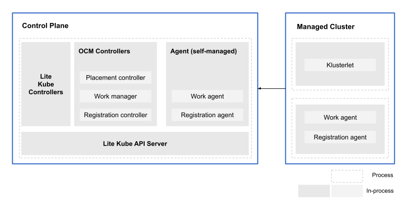

[comment]: # ( Copyright Contributors to the Open Cluster Management project )
# multicluster-controlplane

The `multicluster-controlplane` is a lightweight Open Cluster Manager (OCM) control plane that is easy to install and has a small footprint. It is more efficient, lightweight, and cost-effective, while improving OCM scalability and support for edge scenarios.



Some of the features are:

- Started the OCM hub control plane in standalone mode.
- Combined the registration and work agent into a single entity.
- Reduced the footprint of both the control plane and agent.

The benefits of these improvements are as follows:

- Quick Startup: The lightweight control plane instance can be started within a very short time, making it easier to consume. This reduces resource consumption and lowers costs.
- Multi-Tenancy: Multiple OCM instances can run in different namespaces within a single Kubernetes cluster. Each instance operates in a pod within its respective namespace. By exposing an endpoint, each OCM instance allows clusters to register as managed clusters.
- Enhanced Edge Scenarios: A single cluster with multiple OCM instances can support more managed clusters compared to a single OCM cluster. This capability is particularly useful in edge scenarios where managing multiple clusters efficiently is crucial.
- Platform Compatibility: The multicluster-controlplane offers broader platform compatibility, including support for *ks platforms (e.g., EKS). Moreover, it can even be executed as a standalone binary without the need for deployment on a Kubernetes cluster. 

## Get started 

## Build

### Build binary

```bash
make vendor
make build
```

### Build image

```bash
export IMAGE_NAME=<customized image. default is quay.io/open-cluster-management/multicluster-controlplane:latest>
make image
```

## Run controlplane as a local binary

```bash
export CONFIG_DIR=<the directory of the controlplane configuration file. default is ./_output/controlplane>
make run
```

You can customize the controlplane configurations by creating a config file and using the environment variable `CONFIG_DIR` to specify your config file directory.

**NOTE**: the controlplane config file name must be `ocmconfig.yaml`

Here is a sample file of `ocmconfig.yaml`:

```yaml
dataDirectory: "/.ocm"
apiserver:
  externalHostname: "http://abcdefg.com"
  port: 9443
  caFile: "ca.crt"
  caKeyFile: "ca.key"
etcd:
  mode: external
  prefix: "/registry"
  servers:
  - http://etcd-1:2379
  - http://etcd-2:2379
  caFile: "etcd-trusted-ca.crt"
  certFile: "etcd-client.crt"
  keyFile: "etcd-client.key"
```

The yaml content shown above is a config file with all fields filled in. Following this to better understand the config file.

Field `dataDirectory` is a string variable indicating the directory to store generated certs ,embed etcd data and kubeconfig, etc. While this field is missed in the config file, the default value `/.ocm` makes sense.

Field `apiserver` contains config for the controlplane apiserver:
- `externalHostname` is a string variable indicating the hostname for external access.
- `port` is a integer variable indicating the binding port of multicluster controlplane apiserver. The default value is `9443`.
- `caFile` is a string variable indicating the CA file provided by user to sign all the serving/client certificates. 
- `caKeyFile` is a string variable indicating the CA Key file for `caFile`.

Field `etcd` contains config for the controlplane etcd:
- `mode` should be `embed` or `external` indicating the multicluster controlplane etcd deploy mode. The value would be `embed` if field `mode` is missed.
- `prefix` is a string variable indicating controlplane data prefix in etcd. The default value is `"/registry"`.
- `servers` is a string array indicating etcd endpoints. The default value is `[]string{"http://127.0.0.1:2379"}`.
- `caFile` is a string variable indicating an etcd trusted ca file.
- `certFile` is a string variable indicating a client cert file signed by `caFile`.
- `keyFile` is a string variable indicating client key file for `certFile`.

**NOTE**: For `apiserver` field: If you want to use your own CA pair to sign the certificates, the `caFile` and `caKeyFile` should be set together. Which means that if one of the two fields is missed/empty, the controlplane would self-generate CA pair to sign the necessary certificates. 

## Use helm to deploy controlplane in a cluster

1. Set the environment variable KUBECONFIG to your cluster kubeconfig path

  ```bash
  export KUBECONFIG=<the kubeconfig path of your cluster>
  ```

2. (Optional) By default, the controlplane will have an embedded etcd, you can use the following command to deploy an external etcd

  ```bash
  make deploy-etcd
  ```

  This external etcd will be deployed in the namespace `multicluster-controlplane-etcd`, its certificates will be created at `./_output/etcd/deploy/cert-etcd` and its service urls will be: `http://etcd-0.etcd.multicluster-controlplane-etcd:2379`, `http://etcd-1.etcd.multicluster-controlplane-etcd:2379`, and `http://etcd-2.etcd.multicluster-controlplane-etcd:2379`

3. Run following command to deploy a controlplane

  ```bash
  helm repo add ocm https://openclustermanagement.blob.core.windows.net/releases/
  helm repo update
  helm search repo ocm
  helm install -n multicluster-controlplane multicluster-controlplane ocm/multicluster-controlplane --create-namespace --set <values to set>
  ```

  - To provide your own ca pairs for controlplane with the following arguements:

    ```bash
    --set-file apiserver.ca="<path-to-ca>",apiserver.cakey="<path-to-ca-key>"
    ```

  - To use external etcd with the following arguements:

      ```bash
      --set-file etcd.ca="<path-to-etcd-ca>",etcd.cert="<path-to-etcd-client-cert>",etcd.certkey="<path-to-etcd-client-cert-key>"
      --set etcd.mode="external",etcd.servers={server1, server2, ...}
      ```

  - To use the OpenShift route with the following arguements:

      ```bash
      --set route.enabled=true
      ```

  - To use the load balance service with the following arguements:

      ```bash
      --set loadbalancer.enabled=true
      ```

  - To use the node port serive with the following arguements:

      ```bash
      --set nodeport.enabled=true
      --set nodeport.port=<your-node-port>
      ```

  - To enable the self management with the following arguements:

      ```bash
      --set enableSelfManagement=true
      ```

  - To delegate the authentication with kube-apiserver with the following arguements:

      ```bash
      --set enableDelegatingAuthentication=true
      ```

  More available config values can be found from [here](https://github.com/open-cluster-management-io/multicluster-controlplane/blob/main/charts/multicluster-controlplane/values.yaml).

### Uninstall the controlplane

```bash
helm uninstall -n multicluster-controlplane multicluster-controlplane
```

## Access the controlplane

- If you run the controlplane as a binary, the controlplane kubeconfig file is in `_output/controlplane/.ocm/cert/kube-aggregator.kubeconfig`

- If you deploy the controlplane in a cluster, run the following command to get the controlplane kubeconfig

  ```bash
  kubectl -n multicluster-controlplane get secrets multicluster-controlplane-kubeconfig -ojsonpath='{.data.kubeconfig}' | base64 -d > multicluster-controlplane.kubeconfig
  ```

  If you enable the authentication delegating, you can set a context for your controlplane in your cluster kubeconfig with the following commands

  ```bash
  external_host_name=<your controplane external host name>
  # if you want to add the ca of your cluster kube-apiserver, using the command:
  # kubectl config set-cluster multicluster-controlplane --server="https://${external_host_name}" --embed-certs --certificate-authority=<the ca path of your cluster kube-apiserver>
  kubectl config set-cluster multicluster-controlplane --server="https://${external_host_name}" --insecure-skip-tls-verify
  kubectl config set-context multicluster-controlplane --cluster=multicluster-controlplane --user=kube:admin --namespace=default
  ```

## Join a cluster

You can use clusteradm to access and join a cluster.

1. Get the join token from controlplane:
```bash
clusteradm --kubeconfig=<controlplane kubeconfig file> get token --use-bootstrap-token
```

2. Join a cluster using controlplane agent is now available in clusteradm(see this [PR](https://github.com/open-cluster-management-io/clusteradm/pull/338) for more details, you should build the latest code).
Add the `--singleton` flag in join command to use the controlplane agent, rather than klusterlet, to join a cluster:

```bash
clusteradm join --hub-token <controlplane token> --hub-apiserver <controlplane apiserver> --cluster-name <cluster name> --singleton
```

3. Access the controlplane apiserver to accept the managed cluster:
```bash
clusteradm --kubeconfig=<controlplane kubeconfig file> accept --clusters <cluster name>
```

**Note**: clusteradm version should be v0.4.1 or later

